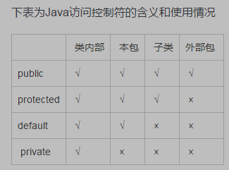

# NOTES FOR JAVA

> 本文是我通过[廖雪峰的官方网站](https://www.liaoxuefeng.com/wiki/1252599548343744)自学Java的笔记，笔记中有些表达习惯可能遵循这个网站。这不是一个系统的学习文档，只是我学习过程中觉得有必要记下的东西，方便我未来查看检索，如果想系统的学习Java，可以参考前面提到的网站。文中有些内容是我个人的理解，可能并不准确，学习过程中会再慢慢修改。

## Game Terms
1. **Class**
```
// class example
public class className{}
```
* `public` --权限
  * `public` 具有最大的访问权限，可以访问任何classpath下的类，接口，异常等
  * `protected` 保护子类
  * `default` 可以访问处于本包下的类，接口，异常等
  * `private` 访问权限仅限于类的内部
  * https://www.cnblogs.com/jingmengxintang/p/5898900.html 
  * 
* `className` --类名
  * 如果文件中只有一个类，类名必须与文件名一致
  * 如果文件中不止一个类，类名必须与public类名一致
  * 一个Java文件中只能有一个public类

2. **Method**
```
// main method
public static void main(String[] args){}
// another method
public String method1(String str, Int integer){}
```
* method是可执行代码块
* `public` 参考class
* `static` 
  * 不需要对象即可调用的方法/变量，没有this的方法 
  * https://www.cnblogs.com/dolphin0520/p/3799052.html
* `void` 无返回值，有返回值则写返回值类型
* `(String[] args)` 参数

3. **面向对象**
* 所谓面向对象，我需要先创造一个对象；想创造对象，我需要先创造一个类，才能new一个对象。
* 这个“类”，不是public类，就是`class Person(){}`（只有访问权限这一个修饰词）
* 类里面的变量（对象的信息），可以是public，可以是private，但是如果是public，别人可以随意篡改，体重给你改成200斤 :) 所以最好变量写成private
* private类型的变量在new 对象的时候不能直接写入
* 所以要在类里写public方法，间接获取或修改对象的性质，这样对象的体重可以控制在90~120斤，其他输入都是bs，常见的`getName()`，`setName()`都是这个意思
* 方法也可以private，只适用于类内操作，比如计算年龄，处理图片，再由其他public方法把计算结果get出来
* `this`始终指向当前实例

4. **构造方法**
* 使用`setValue1()`，`setValue2()`这种方式创建实例很费事，如果想在创建实例的时候就设置合适的（有限制的）值，可以使用构造函数
* 构造函数需要和类同名
* 一个类可以有多个构造函数，根据输入参数个数/类型不同，自动判别使用哪个构造函数

5. **重载 Overload**
* 在一个类中，对于功能类似，参数不同的方法，可以写成同名方法，`hello()`和`hello(String name)`
* 重载方法的返回值类型都是相同的

6. **继承 extend**
* 写完Person类，你想写个Student类，他们会有重复的字段和方法，比如`name`，`getName()`，这时候通过student类继承person类，就可以获得person类的功能，只要添加新功能就可以
* person类称为父类(parent class)或超类(super class)或基类(base class)，student类成为子类(subclass)或扩展类(extended class)
* 继承无法访问父类的private字段和private方法，为了让子类可以访问方法，可用`protected`修饰父类字段和方法
* `super`关键字表示父类，子类引用父类字段时可用`super.name`
* Java中，任何class的构造方法，第一行必须是调用父类的构造方法，如果没有调用，编译器会自动加上无参数的调用父类方法`super();`，但是如果父类本身没有无参数的构造方法，就会报错，所以要自己在子类的构造方法先调用父类的构造函数，该有啥参数就给啥参数
* 向上转型(upcasting)：`Person p = new Student();`，子类继承自父类，拥有父类的全部功能，所以可以
* 向下转型(downcasting)：`Student s = (Student) p;`，只有当父类类型实际指向子类实例时，才能向下转型
* `Person p = new Student();`中，person是引用类型，student是实例类型，这里的person类型的p指向student实例。
* `instanceof`用于检测一个实例是不是某个类型，`System.out.println(p instanceof Student);`。student可以认为是person类型，但person类型不是student类型

7. **多态 Polymorphic/覆写 override**
* 继承关系中，子类如果定义了一个与父类签名(方法名+修饰关键词+参数)完全相同的方法，成为覆写
* @override
* 多态是指，针对某个类型的方法调用，其真正执行的方法取决于运行时期实际类型的方法，运行期才能动态决定调用的子类方法。比如，person和student类里都有run函数，且签名一致
* 参考polymorphicPractice.java
* https://www.liaoxuefeng.com/wiki/1252599548343744/1260455778791232
* 为什么要覆写，不直接写多个class？因为可以只声明一次，利用多态，把一个类里的不同子类都按各自需要执行。覆写是针对继承关系设计的，继承关系的存在就是因为有时候不同类之间用到相同的参数和方法，有了继承关系可以节省很多力气。如果不能覆写，那么一个父类的各个子类要分别写不同名的方法，执行的时候不能遍历执行。利用多态的“真正执行的方法取决于实际类型的方法” + “向上转型”，就可以充分复用代码。
* 如果父类并不需要执行`run()`，只是为了让子类覆写？
  * 加`abstract`关键词，成为抽象方法。`public void abstract run();`不需要写执行块。
  * 但是包含抽象方法的类不能实例化。比如person里有抽象方法run()，就不可以`Person p = new Person();`
  * 包含抽象方法的类的子类必须覆写父类的抽象方法
  * 抽象类可以含普通方法，可以有字段
  * 子类也不能写构造函数？因为子类的构造函数必须先调用父类的构造函数，可是父类不能实例化？
  * 通过抽象父类去引用子类实例，如`Person s = new Student();`，`Person t = new Teacher();`

8. **接口 interface**
* 当一个抽象类没有实例字段，全都是抽象方法，就可以写成接口`interface`，比如`interface Person{}`
* interface中不用写public abstract字段，因为默认所有方法都是，签名只要写返回值类型和方法名就行了
* 具体class使用interface时，用`implements`，比如`class Student implements Person{}`
* 一个类只能继承自一个类，但是一个类可以使用多个接口
* implement了interface的实例类，必须override接口的abstract方法。(比如计时器，必须要写停止条件？)这就是留给实例类的“设置”空间
* `default`方法实现类不必覆写
* 注意区分interface和抽象类的区别

9. **静态字段和静态方法**
* 静态字段用`static`关键字，如`public static int number;`
* 对于静态字段，无论哪个实例试图修改都无效，因为静态字段不属于实例
* 可以把静态字段看作描述class本身的字段
* 调用实例方法需要创造实例，调用静态方法不用，只通过类名即可调用
* 静态方法属于class，不属于实例，所以无法使用`this`关键字
* interface不能有实例字段，但可以有静态字段，且必须为final，如`public static final int MALE = 1;`，因为修饰词都一样，可以简写为`int MALE = 1;`

10. **包和包的鸡毛**
* 包就像收纳盒，添加`package`把同名的不同类放在不同的盒子里，包可以是多层结构，大盒套小盒
* 在Java文件第一行写`package large.medium.small.packageName;`即可，注意packageName要和这个文件所在的folder同名
* 好像必须有包结构才写`package`？
  
  我的Java files里的零散文件如果加包名会报错(the declared package "*" does not match the expected package "")
* 包作用域
  * 不用public，protected，private修饰的**字段和方法**就是包作用域
  * 位于同一个包的类，可以访问包作用域的字段和方法
* `import`导入完整类名可以使用这个类，不推荐用*之间导入整个包，因为有时候会不知道某个类输入哪个包
* `import static`可以导入静态字段或静态类


## Do you know this?
1. 执行Java文件的时候需要用`javac`把`.java`转化成`.class`然后用java执行（https://www.liaoxuefeng.com/wiki/1252599548343744/1255878730977024）
   
2. 声明变量的时候，如`int x = 1;`，JVM在内存中分配一个单元存入数值
   
3. 计算机最小存储单元是byte
   
   以上只是基本数据类型，还有其他数据类型如String
4. String字符串不可变，重新赋值只能改变string变量的指向
   
5. 数组类型
   * `int[] ns = { 68, 79, 91, 85, 62 };`
   * index start from 0
   * 大小不可改变
   * https://www.liaoxuefeng.com/wiki/1252599548343744/1255941599809248
6. `printf`输出含占位符，`System.out.printf("%.2f\n", d);`
   
7. `break`用于跳出当前循环，常用场景为for循环中套一个if语句，满足某条件时跳出这个for循环
8. `continue`用于跳出本次循环，比如当n等于10时跳过本次循环，继续执行n=11的情况
9. `String[] args`是命令行参数，是一个String array，名字叫args，这个输入是在cmd运行java代码时输入的
    ```
    javac testArgs.java
    java testArgs -version
    ```
10. 方法输入参数可以写为`public void setNames(String... names){}`，输入为可变参数，其实就是String类型的数组，但是调用方法的时候不用自己`new String [] = names;`， 可以直接`dorm2207.setNames("Wusheng", "Jingyu", "Idd", "Krystal Ruixue Yang");`
11. 方法参数的绑定没太懂，看这页 https://www.liaoxuefeng.com/wiki/1252599548343744/1260452774408320
12. `final` can help you leave the whole world
13. 方法内部定义的变量成为局部变量，class的字段有private，protected，public，或package的作用域，method里的字段都是局部字段
14. `classpath`就是一组目录的集合，用来指示JVM如何搜索class，不要把Java核心库添加到classpath (https://www.liaoxuefeng.com/wiki/1252599548343744/1260466914339296)
15. jar包就是zip格式的压缩文件，可以把散落的`.class`文件打包进去 (https://www.liaoxuefeng.com/wiki/1252599548343744/1260466914339296)


# Grammar
* if
  ```
  if (condition){
      //excute when condition satisfied
  }else if (condition 2){
      //excute when condition satisfied
  }else (last condition){
      //excute when condition satisfied
  }

  if (score < 60){
      System.out.println("Failed!")
  }else if (score < 80){
      System.out.println("Good!")
  }else{
      System.out.println("Great!")
  }
      
  ```
* switch
  ```
  switch(optionVariable){
      case optionValue1:
        System.out.println("Option 1");
        break;
    case optionValue2:
        System.out.println("Option 2");
        break;
    case optionValue3:
        System.out.println("Option 3");
        break;
  }
  ```
* while
  ```
  // 当心死循环！！
  while(condition){
      //excute when condition satisfied
  }

  int n = 1;
  while(n <= 10){
      System.out.println(n);
      n ++;
  }
  ```
* do while
  ```
  do{
      // excute first, then judge condition
  }while(condition);
  ```
* for
  ```
  for (int i=1; i<=10; i++){
      System.out.println(i);
  }

  int[] ns = { 1, 4, 9, 16, 25 };
  for (int i=0; i<ns.length; i++) {
      System.out.println(ns[i]);
  }
  ```